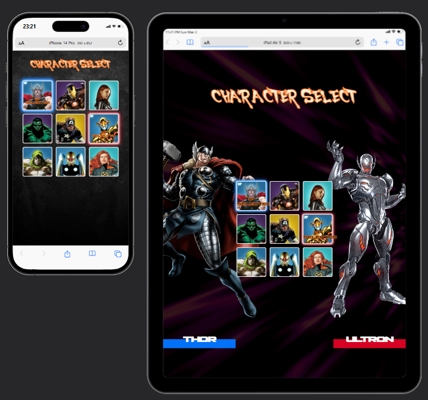

<div align="center">

<h1>Seleção de Personagens da Marvel</h1>


</div>

Este projeto é uma página web interativa onde dois jogadores podem escolher seus personagens favoritos da Marvel para uma batalha imaginária. O projeto foi desenvolvido com HTML, CSS e JavaScript, focado na manipulação do DOM, estilização responsiva e animações.

## Funcionalidades

O projeto implementa as seguintes funcionalidades:

1.  **Seleção por Mouseover:**
    *   Quando o mouse passa sobre um personagem, ele é destacado com uma borda azul ou vermelha (dependendo do jogador) e uma animação de brilho.
    *   O nome e a imagem do personagem em tamanho grande são atualizados no painel lateral correspondente ao jogador que está selecionando.
    *   A tag "1P" ou "2P" aparece no canto superior esquerdo do personagem, identificando qual jogador está com o mouse sobre ele.

2.  **Seleção por Clique:**
    *   O jogador clica no personagem desejado para selecioná-lo.
    *   Uma vez selecionado, a tag **"1P"** ou **"2P"** permanece visível no canto superior esquerdo do personagem, indicando que aquele jogador já escolheu.
    *   A palavra **"1P Selected"** ou **"2P Selected"** aparece sobre o personagem escolhido, no centro da imagem, confirmando a seleção.
    *   O primeiro jogador a selecionar trava a seleção, impossibilitando a mudança, e permite que o segundo jogador faça sua escolha.
    * O jogador 2 não pode selecionar o mesmo personagem que o jogador 1.

3.  **Responsividade:**
    *   O layout do site se adapta a diferentes tamanhos de tela, incluindo dispositivos móveis, tablets e desktops.
    *   Imagens de fundo específicas para desktop e mobile garantem uma boa experiência em todas as telas.

<div align="center">

</div>

4.  **Animações:**
    *   Efeitos de brilho ("glowing") nas bordas dos personagens selecionados.
    *   Animações de brilho ("glowing") no texto "1P" e "2P".

## Tecnologias Utilizadas

*   **HTML5:** Estrutura da página web.
*   **CSS3:** Estilização, layout e animações.
    *   `@keyframes`: para definir as animações de brilho.
    *   `opacity`: para controlar a visibilidade da tag "1P" e "2P".
    *   `position: absolute`: Para posicionar as tags no canto da imagem do personagem e no meio.
    *   `transform: translate`: para centralizar as tags.
    *   `@media`: Para criar os layouts responsivos.
*   **JavaScript:** Interatividade, manipulação do DOM, eventos do mouse, controle de estado.
    *   `querySelectorAll`: para selecionar os elementos.
    *   `addEventListener`: para controlar os eventos.
    * `createElement`: para criar os elementos `p` na tag.
    * `appendChild`: para colocar o elemento criado dentro de outro elemento.
    * `classList.add` e `classList.remove`: para controlar a exibição de classes e fazer as animações e visibilidade.
    * `innerText`: para modificar os textos.
*   **Fontes personalizadas:**
    * `ssf4`: para o texto dos nomes.
    * `command`: para os títulos.
* **Imagens GIF e JPG**: Para as imagens de fundo.

## Estrutura de Arquivos
<div align="center">

</div>

## Como Executar o Projeto

1.  Clone o repositório:
    ```bash
    git clone https://github.com/ezyn/Marvel-Character-Select
    ```
2.  Navegue até a pasta do projeto:
    ```bash
    cd projeto-marvel-mapadev-week
    ```
3.  Abra o arquivo `index.html` em seu navegador.

## Melhorias Futuras

*   **Adicionar mais personagens:** Expandir a lista de personagens disponíveis para escolha.
*   **Tela de batalha:** Criar uma tela de batalha após a seleção dos personagens.
*   **Efeitos sonoros:** Adicionar efeitos sonoros para aumentar a imersão.
*   **Animações mais complexas:** Criar animações mais elaboradas para os personagens.
* **Banco de dados:** Criar um banco de dados para registrar as seleções.

## Contribuição

Contribuições são bem-vindas! Sinta-se à vontade para abrir *issues* ou *pull requests* para sugerir melhorias, corrigir bugs ou adicionar novas funcionalidades.

## Autor

* Projeto ministrado pelo curso **Dev Quest Dev em Dobro** e personalizado por mim  **Wesley Santos:** aluno do curso, turma 18.

### Observação:
Projeto está comentado para fins de estudo.

## Licença

Este projeto está licenciado sob a [Licença MIT](https://opensource.org/license/mit/) - consulte o arquivo `LICENSE.md` para obter detalhes.

---
